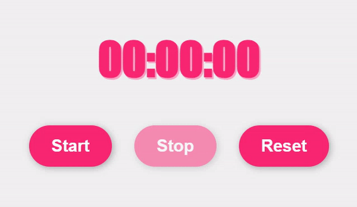

# Stopwatch


## 기능 
스톱워치

(1) start 버튼을 클릭하면 시계가 움직임  
(2) stop 버튼을 클릭을 하면 시계가 정지  
(3) reset 버튼을 클릭을 하면 시계가 초기화

<br>

## 학습  

### 1. CSS : button 태그의 disabled 속성  
: 해당 <u>버튼이 비활성화</u>됨을 명시  

: disabled 속성이 명시된 버튼은 사용할 수 없으며, 사용자가 클릭할 수도 없습니다.

: 따라서 이 속성을 사용하면 <u>특정 조건이 충족될 때까지 사용자가 버튼을 클릭할 수 없도록 설정하고, 특정 조건이 충족되면 자바스크립트 등으로 disabled 속성값을 삭제하여 사용자가 버튼을 다시 사용할 수 있도록 조절</u>할 수 있습니다.  

: disabled 속성은 <u>불리언(boolean) 속성</u>입니다.

: 불리언 속성은 해당 속성을 명시하지 않으면 속성값이 자동으로 false 값을 가지게 되며, <u>명시하면 자동으로 true 값</u>을 가지게 됩니다.

```
<button disabled>
```

### 2. JS : Date.now() 
UTC 기준으로 1970년 1월 1일 0시 0분 0초부터 현재까지 경과된 밀리초를 반환  
```
<p id="demo"></p>
// 1701715915180

<script>
let ms = Date.now();
document.getElementById("demo").innerHTML = ms;
</script>
```


## 학습 출처
**유튜브**    
**CSS**  
https://www.tcpschool.com/html-tag-attrs/button-disabled   
**JS**  
**키워드**  